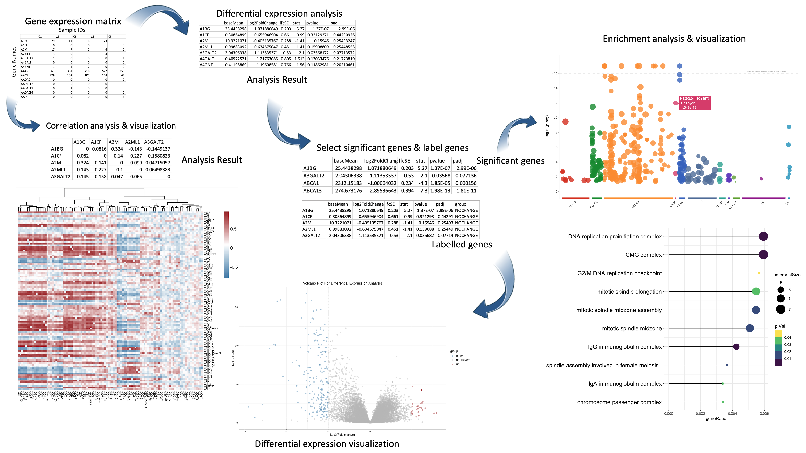

<!-- README.md is generated from README.Rmd. Please edit that file -->

```{r, include = FALSE}
knitr::opts_chunk$set(
  collapse = TRUE,
  comment = "#>",
  fig.path = "man/figures/README-",
  out.width = "100%"
)
```

# GEAnaly

Analyze gene expression matrix data within a well-constructed pipeline, integrating differential enpression analysis, enrichment analysis and gene correlation analysis into a single command

<!-- badges: start -->
<!-- https://www.codefactor.io/repository/github/ReaganGen/GEAnaly/issues -->
[](https://github.com/ReaganGen/GEAnaly/issues)  [](./LICENSE)  

<!-- https://shields.io/category/license -->
<!-- badges: end -->

## Description

`GEAnaly` is an R package that implements a pipeline, which integrates gene differential expression analysis, gene enrichment analysis and gene correlation analysis together for the analysis of gene expression matrix data and visualization of the results of each analysis in the pipeline. The whole analysis pipeline can be executed in a single command efficiently.

The pipeline of the package is basically:
Gene expression matrix data → Gene differential expression analysis → Select genes that are differentially expressed → Enrichment analysis for those differentially expressed genes, correlation analysis would also be applied on Gene expression matrix data. Apart from that, for each analysis, visualizations of results are generated.

The biological data analyzed by GEAnaly would be the gene expression data (usually generated from RNA-sequencing experiments), which are the expression matrix of genes in different samples, and the table that records the information about the experimental samples (like sample names and if they are controlled sample or treated sample). In the expression matrix file, the names of rows are gene names, and the names of columns are sample names. The expression matrix file records the estimated count of sequencing reads of each gene (un-normalized counts). 

Currently, performing a complete bioinformatics pipeline to analyze gene expression matrix data requires programming skills and experience on processing data. However, it is hard for biologists to learn programming in a short period of time. Therefore, GEAnaly aims to make the analysis of gene expression data as easy as possible without adjusting file formats between different analysis. Also, this package provides a very simplified data analysis experience for biologists with no programming experiences, eliminating the manual construction of the workflow. In addition, users can use very simple commands to visualize the analysis results, once again simplifying the analysis process, and improving analysis efficiency. The `GEAnaly` package was developed using `R version 4.3.1 (2023-06-16)`, `Platform: aarch64-apple-darwin20 (64-bit)` and `Running under: macOS Sonoma 14.1`.


## Installation

To install the latest version of the package:

``` r
install.packages("devtools")
library("devtools")
devtools::install_github("ReaganGen/GEAnaly", build_vignettes = TRUE)
library("GEAnaly")
```

When installing the `GEAnaly` package, sometimes there exists an error. The error indicates that "Package DESeq2 is not available for this version of R", to solve it, run the following codes:
```r
if (!require("BiocManager", quietly = TRUE))
    install.packages("BiocManager")

# install DESeq2 manually
BiocManager::install("DESeq2")
```
Then repeat the installation codes above.

To run the Shiny app:
```r
Under construction
```
## Overview

``` r
# To list all available functions and datasets in the package, use command:
ls("package:GEAnaly")

# To list all example datasets available in the package:
data(package = "GEAnaly") 

# To see the tutorial of GEAnaly
browseVignettes("GEAnaly")
```

`GEAnaly` contains 11 functions:

1.  ***runGEAnaly***: Execute the differential expression analysis and enrichment analysis and their visualizations in a single call of a function.

2.  ***runGEAnalyCor***: Execute the gene correlation analysis and its visualization in a single call of a function.

3.  ***diffExpressionAnalysis***: Perform differential expression analysis on gene expression matrix data.

4.  ***corrAnalysis***: Perform gene expression correlation analysis on gene expression matrix data.

5.  ***extractSignificantGene***: Filter out the genes that have significantly different expression levels in different samples based on the threshold provided and the results of differential expression analysis.

6.  ***labelGenes***: Label genes with "UP", "DOWN" and "NOCHANGE" according to the pValue and foldChange thresholds provided.

7.  ***enrichAnalysis***: Perform genes' functional enrichment analysis, which is the procedure of identifying functions that are over- or under-represented among a set of genes.

8.  ***visDeAnaly***: Generate a volcano plot for the differential expression analysis result.

9. ***visCorrelationAnaly***: Generate a heatmap plot for the gene correlation analysis result.

10.  ***visEnrichAnaly***: Generate a Manhattan plot for the enrichment analysis result.

11.  ***visEnrichAnalyLollipop***: Generate a Lollipop plot for the enrichment analysis result (show the top 10 biological pathways with top 10 highest gene ratio values).

The package also contains 8 datasets. 
```r
# use the following command to list all example datasets available in the package:
data(package = "GEAnaly") 

# Use ? to check details of the data.
?diffExpressionResult
```

Refer to package vignettes for more details. An overview of the package is illustrated below:


## Contributions

The author of the package is Gen Li. The author defined all functions used in the package, including `runGEAnaly`, `runGEAnalyCor`, `diffExpressionAnalysis`, `corrAnalysis`, `extractSignificantGene`, `labelGenes`, `enrichAnalysis`, `visDeAnaly`, `visCorrelationAnaly`, `visEnrichAnaly` and `visEnrichAnalyLollipop`. The main contribution of the author was integrate multiple analyses into a single function. Apart from that, the author also developed various visualization functions for different visualization choices.

The author defined `runGEAnaly` to integrate differential expression analysis and enrichment analysis and their visualizations into a quick single call of a function. Also, the author defined `runGEAnalyCor` to integrate correlation analysis and its visualization into a single call of the function. Apart from that, `diffExpressionAnalysis` used functions `DESeqDataSetFromMatrix`, `DESeq` and `results` from the package `DESeq2` as the core for the differential expression analysis. The function `extractSignificantGene` applied the `filter` function from package `dplyr` to select genes with significant differences in expression levels in different samples. The function `labelGenes` used `mutate` function from package `dplyr` to filter and label genes. Furthermore, the function `enrichAnalysis` used the `gost` function from the package `gprofiler2` to implement the enrichment analysis. In addition, the function for correlation analysis, which is `corrAnalysis`, used the `cor` function from the package `stats` to calculate the correlation coefficient between pairs of genes. The functions for visualizations (`visDeAnaly`, `visCorrelationAnaly`, `visEnrichAnaly`, `visEnrichAnalyLollipop`), all used package `ggplot2` to create comprehensible figures. Specifically, `visCorrelationAnaly` made use of package `pheatmap` and `grDevices` to plot the visualization for the correlation analysis. Also, function `visEnrichAnaly` employed `gprofiler2::gostplot()` to assist in plotting of the Manhattan plot for the enrichment analysis, and used  `htmlwidgets` to save the interactive version of the plot. Generative AI tool was never used during the development.

## References

- Geistlinger, L., Csaba, G., Zimmer, R. (2016). “Bioconductor's EnrichmentBrowser: seamless navigation through combined results of set- & network-based enrichment analysis.” BMC Bioinformatics, 17, 45. doi:10.1186/s12859-016-0884-1.

- Kolberg, L., Raudvere, U., Kuzmin, I., Vilo, J., Peterson, H. (2020). “gprofiler2-an R package for gene list functional enrichment analysis and namespace conversion toolset g:Profiler.” F1000Research, 9 (ELIXIR)(709). R package version 0.2.2.

- Kolde, R. (2019). pheatmap: Pretty Heatmaps. R package version 1.0.12, https://CRAN.R-project.org/package=pheatmap

- Love, M. I., Huber, W., Anders, S. (2014). Moderated estimation of fold change and dispersion for RNA-seq data with DESeq2. Genome Biology, 15(12):550. https://doi.org/10.1186/s13059-014-0550-8
  
- Overmyer, K. A., Shishkova, E., Miller, I. J., Balnis, J., Bernstein, M. N., Peters-Clarke, T. M., Meyer, J. G., Quan, Q., Muehlbauer, L. K., Trujillo, E. A., He, Y., Chopra, A., Chieng, H. C., Tiwari, A., Judson, M. A., Paulson, B., Brademan, D. R., Zhu, Y., Serrano, L. R., … Jaitovich, A. (2021). Large-scale multi-omic analysis of COVID-19 severity. Cell Systems, 12(1). https://doi.org/10.1016/j.cels.2020.10.003 

- Posit team (2023). RStudio: Integrated Development Environment for R. Posit Software, PBC, Boston, MA. URL http://www.posit.co/.
  
- R Core Team (2023). R: A Language and Environment for Statistical Computing. R Foundation for Statistical Computing, Vienna, Austria. https://www.R-project.org/

- Vaidyanathan, R., Xie, Y., Allaire, J., Cheng, J., Sievert, C., Russell, K. (2023). htmlwidgets: HTML Widgets for R. R package version 1.6.2, https://CRAN.R-project.org/package=htmlwidgets

- Wickham, H., François, R., Henry, L., Müller, K., Vaughan, D. (2023). dplyr: A Grammar of Data Manipulation. R package version 1.1.3, https://CRAN.R-project.org/package=dplyr

- Wickham H. (2016). ggplot2: Elegant Graphics for Data Analysis. Springer-Verlag New York. https://CRAN.R-project.org/package=ggplot2

- Yu G. (2023). ggplotify: Convert Plot to 'grob' or 'ggplot' Object.
R package version 0.1.2, https://CRAN.R-project.org/package=ggplotify


## Acknowledgements

This package was developed as part of an assessment for 2023 BCB410H: Applied Bioinformatics course at the University of Toronto, Toronto, CANADA. GEAnaly welcomes issues, enhancement requests, and other contributions. To submit an issue, use the GitHub issues.
