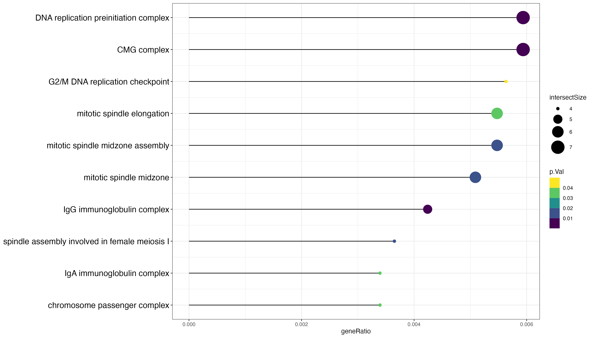
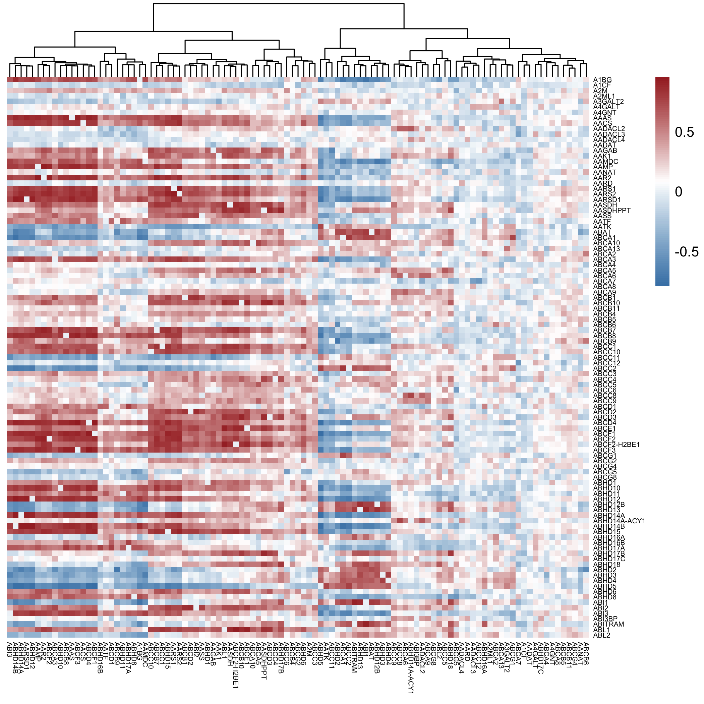

```{r setup, include=FALSE}
library(knitr)
opts_chunk$set(fig.align = "center", 
               out.width = "90%",
               fig.width = 6, fig.height = 5.5,
               dev.args=list(pointsize=10),
               par = TRUE, # needed for setting hook 
               collapse = TRUE, # collapse input & ouput code in chunks
               warning = FALSE)
knit_hooks$set(par = function(before, options, envir)
  { if(before && options$fig.show != "none") 
       par(family = "sans", mar=c(4.1,4.1,1.1,1.1), mgp=c(3,1,0), tcl=-0.5)
})
set.seed(1) # for exact reproducibility
```

## Introduction to the package
Measuring gene expression levels in different samples and linking the expression of genes of interest to a biological pathway helps scientists understand gene functions, biological processes and the genes that play important roles in regulations. It is common to perform the gene expression analysis for scientific purposes.

`GEAnaly` is an R package that implements a pipeline, which integrates gene differential expression analysis, gene enrichment analysis and gene correlation analysis together for the analysis of gene expression matrix data and visualization of the results of each analysis in the pipeline. The whole analysis pipeline can be executed in a single command efficiently.

The pipeline of the package is basically:
Gene expression matrix data → Gene differential expression analysis → Select genes that are differentially expressed → Enrichment analysis for those differentially expressed genes, correlation analysis would be applied on Gene expression matrix data.

The package aims to make the analysis of gene expression data as easy as possible without adjusting file formats between different packages. Also, this package provides a very simplified data analysis experience for biologists with no programming experiences, eliminating the manual construction of workflows. In addition, users can use very simple commands to visualize the analysis results, once again simplifying the analysis process, and improving analysis efficiency.

This document gives a quick tour of GEAnaly. It was written in R Markdown, using the knitr package for production.
Use `help(package = "GEAnaly")` for more information about the package and `citation("GEAnaly")` for how to cite the package. 

To download **GEAnaly**, use the following commands:

```{r}
require("devtools")
devtools::install_github("ReaganGen/GEAnaly", build_vignettes = TRUE)
library("GEAnaly")
```

To list all available functions and datasets in the package, use the following command:

```{r}
ls("package:GEAnaly")
```

To list all example datasets available in the package:
``` {r}
data(package = "GEAnaly")
```

<br>

## Quick start
To perform all differential expression analysis, enrichment analysis and correlation analysis quickly, the function `runGEAnaly` and `runGEAnalyCor` should be used, more information could be viewed in `?runGEAnaly` and `?runGEAnalyCor`:
```{r}
# Using gene counts matrix (geneCountsDiffExpression) and the sample
# information (sampleInforDiffExpression) available with the package
# For more information about the data, use '?geneCountsDiffExpression' and 
# '?sampleInforDiffExpression' to check

dim(geneCountsDiffExpression) # 11000 rows, 126 columns
dim(sampleInforDiffExpression) # 126 rows, 2 columns

# Create a subdirectory to store the output of the pipeline
# All the files generated are stored in the outPath defined below
subDir <- "tutorialOutput"
if (file.exists(subDir)){ 
  
  outPath <- file.path(getwd(), subDir)
  
} else {  
  
  dir.create(file.path(getwd(), subDir))
  outPath <- file.path(getwd(), subDir)
  
}

# Perform the whole gene expression analysis pipeline on the input gene
# counts matrix with default settings
# You should see all visualizations and all results from each stage of the
# pipeline in the outPath directory
runGEAnaly(geneCountsDiffExpression,
          sampleInforDiffExpression,
          filePath = outPath)

# Using gene counts matrix (geneCountsCorrelation) available with the package
# For more information about the data, use '?geneCountsCorrelation' to check
dim(geneCountsCorrelation) # 105 rows, 41 columns

# Perform the gene correlation analysis pipeline on geneCountsCorrelation
# You should see visualizations and results for the corrrelation analysis in 
# outPath defined before
runGEAnalyCor(geneCountsCorrelation,
              filePath = outPath)

```
All output results files and visualizations will be discussed in detail later in the tutorial.

<br>

## Differential expression analysis
Each step in the pipeline can be performed independently. To perform the differential expression analysis, function `diffExpressionAnalysis` should be used, more information could be viewed in `?diffExpressionAnalysis`:
```{r}
# Using gene counts matrix (geneCountsDiffExpression) and the sample
# information (sampleInforDiffExpression) available with the package
# For more information about the data, use '?geneCountsDiffExpression' and 
# '?sampleInforDiffExpression' to check

dim(geneCountsDiffExpression) # 11000 rows, 126 columns
dim(sampleInforDiffExpression) # 126 rows, 2 columns

# Perform differential expression analysis on the input gene counts matrix
# The result of the differential expression is kept for further processed
deResult <- diffExpressionAnalysis(geneCountsDiffExpression,
                                   sampleInforDiffExpression)

head(deResult)

```

<br>

## Select genes that show significantly different expression levels
After performing the differential expression analysis, genes are up-expressed or down-expressed or have no significant changes in expression. To select genes that has significantly different expression levels in different samples, `extractSignificantGene` should be used. To label genes with "UP", "DOWN" and "NOCHANGE" labels, `labelGenes` should be used. More information could be viewed in `?extractSignificantGene` and `?labelGenes`:
```{r}
# Using differential expression analysis result
# Filter out genes with significantly different expression levels
# This creates a significant_de_genes.csv file stores the result
# in the outPath defined before
# Can also use the example differential expression analysis result
# (diffExpressionResult) available with the package
significantGenesE <- extractSignificantGene(deResult,
                                            filePath = outPath,
                                            pValue = 0.05,
                                            foldChange = 2)

# significantGenesE is saved to significant_de_genes.csv
head(significantGenesE)

# Using differential expression analysis result label genes based on the input threshold
# This creates a de_genes_with_label.csv file stores the result
# in the outPath defined before
# Can also use the example differential expression analysis result
# (diffExpressionResult) available with the package
labelGenesE <- labelGenes(deResult,
                          filePath = outPath,
                          pValue = 0.05,
                          foldChange = 2)

# Genes with labels are used for visualization of the differential expression analysis
# labelGenesE is saved to de_genes_with_label.csv 
head(labelGenesE)


```

<br>

## Enrichment analysis
After we got the genes with significantly different expression levels, they will be sent for an enrichment analysis to check if these genes enrich in the regulation of some pathways. To Perform the enrichment analysis, function `enrichAnalysis` should be used, more information could be viewed in `?enrichAnalysis`:
```{r}
# Perform enrichment analysis and save the output as a 
# enrich_analysis_result.tsv file in the in the outPath defined before
enrichOutputListE <- enrichAnalysis(significantGenesE,
                                   pvalueCutoff = 0.05,
                                   correctionMethod = "g_SCS",
                                   filePath = outPath)

# Access the results stored in the list returned
dim(enrichOutputListE$gProfilerResult$result)
enrichOutputListE$gProfilerResult$result[1:5, 1:5]
colnames(enrichOutputListE$gProfilerResult$result)

print("===================================================")

# enrichOutputListE$enrichmentVis is saved to enrich_analysis_result.tsv
head(enrichOutputListE$enrichmentVis)

# Both enrichOutputListE$gProfilerResult and enrichOutputListE$enrichmentVis 
# are used for visualizations

```

## Gene correlation analysis 
We can perform the correlation analysis at anytime as long as we have the gene expression matrix data, which is in the same format as the input matrix for differential expression analysis. Function `corrAnalysis` should be used, more information could be viewed in `?corrAnalysis`:
```{r}
# Use the gene expression data geneCountsCorrelation available with the package
dim(geneCountsCorrelation) # 105 rows, 41 columns

# Perform gene correlation analysis on the input gene counts matrix 
# This creates a correlation_analysis_result.csv file that stores the result
# in the outPath defined before
corrResult <- corrAnalysis(geneCountsCorrelation,
                           filePath = outPath,
                           method = "pearson")

# corrResult is saved to correlation_analysis_result.csv
dim(corrResult)
corrResult[1:5, 1:5]
```


## Visualizations
The package visualizes the results of differential expression analysis, enrichment analysis and correlation analysis. 

### Visualization for differential expression analysis
For the differential expression analysis, a volcano plot is used for the visualization. To generate the plot, function `visDeAnaly` should be used. More information could be viewed in `?visDeAnaly`:
```{r}
# Use labelled genes (labelGenesE) generated by the labelGenes function
# Can also use labelled genes (labelledGenes) available with the package
dim(labelGenesE) # 10393 rows 7 columns

# Plot a volcano plot for the differential expression analysis results
# with colorblind-friendly colors
visDeAnaly(labelledGenes, colorBlindF = TRUE, filePath = outPath)

# You should see visualizations saved in outPath, 
# named as DiffExpresion_volcano_plot.png

```

### Visualization for enrichment analysis
For the enrichment analysis, an interactive or non-interactive Manhattan plot and a Lollipop plot are generated for visualization. Function `visEnrichAnaly` and `visEnrichAnalyLollipop` are used. Use `?visEnrichAnaly` and `?visEnrichAnalyLollipop` for more information:
```{r}
# Use enrichment analysis result generated by enrichAnalysis
# Can also use enrichment analysis output (enrichOutputList) available with the
# package
# Plot a Manhattan plot for the enrichment analysis results 
# (both interactive and non-interactive)
visEnrichAnaly(enrichOutputListE, interactive = TRUE, filePath = outPath)
visEnrichAnaly(enrichOutputListE, interactive = FALSE, filePath = outPath)

# Plot a Lollipop plot for the enrichment analysis results, the plot shows the 
# top 10 pathways with top10 highest gene ratio. 
visEnrichAnalyLollipop(enrichOutputList, filePath = outPath)

# You should see visualizations saved in the outPath,
# named as enrich_analysis_vis.html and enrich_analysis_vis.png and enrich_analysis_vis_Lollipop.png
```
<div style="text-align:center">


### Visualization for correlation analysis
For the correlation analysis, a heatmap is generated to show the correlation coefficient between pairs of genes. Function `visCorrelationAnaly` should be used, `?visCorrelationAnaly` for more information:
```{r}
# Use the correlation analysis result corrResult generated by corrAnalysis
# Can also use correlation result (geneCorResult) available with the package
dim(corrResult) # 103 rows, 103 columns

# Plot a heatmap for the correlation analysis results
# Can input customized colors
visCorrelationAnaly(corrResult, 
                    colors = c("steelblue","white","brown"), 
                    filePath = outPath)

# You should see visualizations saved in outPath,
# named as correlation_analysis_vis.png

```
<div style="text-align:center">


## Package References
- Li, G. (2023) GEAnaly: An R Package For Analysis Of Gene Expression Matrix. Unpublished. URL:
  https://github.com/ReaganGen/GEAnaly
  
## Other References
- Chang, W., Cheng, J., Allaire, J., Sievert, C., Schloerke, B., Xie, Y., Allen, J.,
McPherson J., Dipert A., Borges B. (2023). shiny: Web Application Framework for R. R package version 1.8.0, https://CRAN.R-project.org/package=shiny.

- Geistlinger, L., Csaba, G., Zimmer, R. (2016). “Bioconductor's EnrichmentBrowser: seamless navigation through combined results of set- & network-based enrichment analysis.” BMC Bioinformatics, 17, 45. doi:10.1186/s12859-016-0884-1.

- Kolberg, L., Raudvere, U., Kuzmin, I., Vilo, J., Peterson, H. (2020). “gprofiler2-an R package for gene list functional enrichment analysis and namespace conversion toolset g:Profiler.” F1000Research, 9 (ELIXIR)(709). R package version 0.2.2.

- Kolde, R. (2019). pheatmap: Pretty Heatmaps. R package version 1.0.12, https://CRAN.R-project.org/package=pheatmap

- Love, M. I., Huber, W., Anders, S. (2014). Moderated estimation of fold change and dispersion for RNA-seq data with DESeq2. Genome Biology, 15(12):550. https://doi.org/10.1186/s13059-014-0550-8
  
- Overmyer, K. A., Shishkova, E., Miller, I. J., Balnis, J., Bernstein, M. N., Peters-Clarke, T. M., Meyer, J. G., Quan, Q., Muehlbauer, L. K., Trujillo, E. A., He, Y., Chopra, A., Chieng, H. C., Tiwari, A., Judson, M. A., Paulson, B., Brademan, D. R., Zhu, Y., Serrano, L. R., … Jaitovich, A. (2021). Large-scale multi-omic analysis of COVID-19 severity. Cell Systems, 12(1). https://doi.org/10.1016/j.cels.2020.10.003 

- Posit team (2023). RStudio: Integrated Development Environment for R. Posit Software, PBC, Boston, MA. URL http://www.posit.co/.
  
- R Core Team (2023). R: A Language and Environment for Statistical Computing. R Foundation for Statistical Computing, Vienna, Austria. https://www.R-project.org/

- Vaidyanathan, R., Xie, Y., Allaire, J., Cheng, J., Sievert, C., Russell, K. (2023). htmlwidgets: HTML Widgets for R. R package version 1.6.2, https://CRAN.R-project.org/package=htmlwidgets

- Wickham, H., François, R., Henry, L., Müller, K., Vaughan, D. (2023). dplyr: A Grammar of Data Manipulation. R package version 1.1.3, https://CRAN.R-project.org/package=dplyr

- Wickham, H. (2016). ggplot2: Elegant Graphics for Data Analysis. Springer-Verlag New York. https://CRAN.R-project.org/package=ggplot2

- Yu, G. (2023). ggplotify: Convert Plot to 'grob' or 'ggplot' Object. R package version 0.1.2, https://CRAN.R-project.org/package=ggplotify

----

```{r}
sessionInfo()
```
